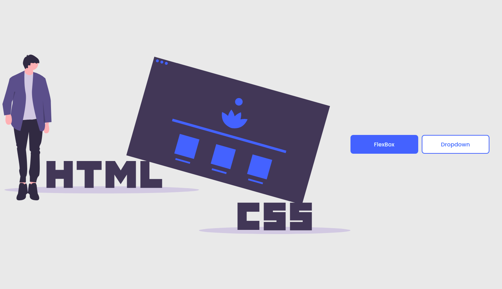

<p align="center">
    <a href="#-projeto">🖥 Projeto</a>&nbsp;&nbsp;&nbsp;|&nbsp;&nbsp;&nbsp;
    <a href="#-tecnologias">👨‍💻 Tecnologias</a>&nbsp;&nbsp;&nbsp;|&nbsp;&nbsp;&nbsp;
    <a href="#-vídeo">🎥 Vídeo</a>&nbsp;&nbsp;&nbsp;|&nbsp;&nbsp;&nbsp;
    <a href="#-executar-o-projeto">🖇 Execução do Projeto</a>&nbsp;&nbsp;&nbsp;|&nbsp;&nbsp;&nbsp;
    <a href="#-licença">📃 Licença</a>&nbsp;&nbsp;&nbsp;|&nbsp;&nbsp;&nbsp;
    <a href="#-observações">📌 Observações</a>
</p>

<h1 style="display: flex; flex-direction: row" align="center">
    
</h1>

## 🖥 Projeto
O intro-css é um projeto de prática iniciante na programação web. Foi criado com o propósito de apresentar um trabalho sobre css, então, para me desafiar, decidi criar um site para apresentar o que eu havia aprendido.

## 👨‍💻 Tecnologias
As tecnologias usadas nesse projeto foram:
- [HTML](https://developer.mozilla.org/en-US/docs/Web/HTML)
- [CSS](https://developer.mozilla.org/en-US/docs/Web/CSS)


## 🎥 Vídeo
[Aula de Flexbox](https://www.youtube.com/embed/TPKP7LbBBL8)

## 🖇 Executar o Projeto
Para executar o projeto, apenas é preciso clonar ele em seu dispositivo:

- Clone o repositório

    ```bash
    $ git clone https://github.com/Yta-ux/intro_css.git
    ```

##  📃 Licença
Esse projeto possui licença MIT. Para mais detalhes consulte o arquivo [LICENSE](LICENSE.md)

## 📌 Observações
Pode sofrer alterações futuras
